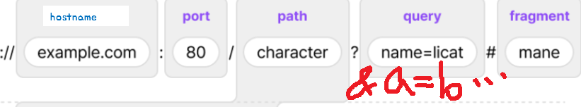

## url

- url이 항상 자원의 주소를 말하는건 아니다
- ex) /about.html로 접속했다고 해서 실제 불러온 값이 /about.html임을 보장하진 않습니다.
- 해킹의 위험이 있기 때문 (크롤링 방지)
- 고도화하면 시간대별로 바꿀수도 있다
- URL은 웹사이트 주소뿐만 아니라 컴퓨터 네트워크상의 자원을 모두 나타낼 수 있습니다.

- 문자열을 url 인코딩으로 변환시켜서 들어감
- => 한국어를 넣어도 괜찮긴 하다

### url의 구조

- 암기하기



```
WHATWG URL's origin property (https://nodejs.org/api/url.html#url)
┌────────────────────────────────────────────────────────────────────────────────────────────┐
│                                             href                                           │
├──────────┬──┬────────────────────┬────────────────────────┬────────────────────────┬───────┤
│ protocol │  │       auth         │          host          │          path          │ hash  │
│          │  │                    ├─────────────────┬──────┼──────────┬─────────────┤       │
│          │  │                    │    hostname     │ port │ pathname │    search   │       │
│          │  │                    │                 │      │          ├─┬───────────┤       │
│          │  │                    │                 │      │          │ │    query  │       │
"  https:   //   user   :   pass   @ sub.example.com : 8080   /p/a/t/h  ? query=string #hash"
│          │  │         │          │    hostname     │ port │          │             │       │
│          │  │         │          ├─────────────────┴──────┤          │             │       │
│ protocol │  │   user  │ password │          host          │          │             │       │
├──────────┴──┼─────────┴──────────┼────────────────────────┤          │             │       │
│   origin    │                    │         origin         │ pathname │    search   │ hash  │
├─────────────┴────────────────────┴────────────────────────┴──────────┴─────────────┴───────┤
│                                             href                                           │
└────────────────────────────────────────────────────────────────────────────────────────────┘
0번 ~ 1023번: 잘 알려진 포트 (well-known port)
1024번 ~ 49151번: 등록된 포트 (registered port)
49152번 ~ 65535번: 동적 포트 (dynamic port)
```

- 서버 실행 코드

```py
# 여기서는 실행이 안됨
from http.server import BaseHTTPRequestHandler, HTTPServer


class CustomHTTPRequestHandler(BaseHTTPRequestHandler):
    def do_GET(self):
        self.send_response(200)
        self.send_header("Content-type", "text/html")
        self.end_headers()

        if self.path == "/a":
            self.wfile.write(b"<h1>a</h1>")
        elif self.path == "/b":
            self.wfile.write(b"<h1>b</h1>")
        elif self.path == "/c":
            self.wfile.write(b"<h1>c</h1>")
        else:
            self.wfile.write(b"<h1>d</h1>")


def run_server(port=8000):
    server_address = ("", port)
    httpd = HTTPServer(server_address, CustomHTTPRequestHandler)
    print(f"Starting server on port {port}")
    httpd.serve_forever()


if __name__ == "__main__":
    run_server()
```

### js의 URL 객체

```js
const url = new URL(
  "https://example.org:8080/a/b/c/d?query=abc&name=hojun#licat"
);

// 파싱하기
// split('/')으로 나누지 않는다.

console.log("전체 URL:", url.href);
console.log("프로토콜:", url.protocol);
console.log("호스트:", url.host);
console.log("호스트네임:", url.hostname);
console.log("포트:", url.port);
console.log("경로:", url.pathname);
console.log("검색:", url.search);
console.log("해시:", url.hash);

// 값 변경이 가능하다
url.protocol = "ftp";

// 쿼리 파라미터를 따로 뺄 수 있다
// URLSearchParams 객체
console.log("URLSearchParams 객체:", url.searchParams);
console.log("query:", url.searchParams.get("query"));
console.log("name:", url.searchParams.get("name"));
```

- query (?~) 이후 나오는 것들은 서버로 전송할 데이터를 나타냄

- py에서 url을 인코딩할 때 '%20'는 띄어쓰기를 나타낸다

# HTTP

- HTTP(HyperText Transfer Protocol) : 클라이언트와 서버 간에 데이터를 주고받기 위한 약속(프로토콜)입니다.
- 프로토콜 : 약속, 통신 규약 (대화를 할때 한국어를 사용하는 것도 한국어가 프로토콜이 된다.)
- 웹상으로 데이터를 주고 받을 때 음성, 이미지 파일을 주고 받을 때 HTTP 약속을 따릅시다
- 업데이트 되기가 쉽지 않다. 거의 모든 컴퓨터에서 쓰이고 있어서
- HTML, XML, Javascript, 오디오, 비디오, 이미지, PDF, Etc은 HTTP 규약을 따라야 한다.

- 한 마디로 문자열 약속이다.

- referer : 어느 페이지를 경유해서 왔는지 알려준다.

## request >

## HTTP 메서드 종류

- GET : 리소스 취득 (? 뒤에 이어붙이는 방식 - 작은 값들)
  - 데이터 조회
  - 데이터 요청
  - URL로 데이터를 전달하는 방식
- POST : 리소스 생성 (Body에 붙이는 방식 - 상대적으로 큰 용량)

  - 데이터 생성
  - 데이터 조회 / 수정 / 삭제 요청 => 다 하는 경우도 있습니다.
  - BODY 부분에 데이터를 전달하는 방식

  - URL공유로 공유하면 이동을 안하게 하고 싶은 경우 모든 페이지를 POST로 ..?
  - 국가(정부) 사이트 같은 경우 페이지를 이동해도 주소(URL)가 변하지 않도록 설정해놓는다
  - URL을 알수 없어서 크롤링이 불가함

- PUT: 리소스의 모든 것을 업데이트
  - 데이터 전체 수정
- DELETE : 리소스 삭제
- PATCH: 리소스의 일부를 업데이트
- OPTIONS : 웹서버가 지원하는 메소드 종류 반환 요청

## HTTP 메서드 실습

- GET

  - GET 요청은 fetch를 그대로 사용해서 요청할 수 있다.

  ```js
  fetch("https://eduapi.weniv.co.kr/444/blog")
    .then((response) => response.json())
    .then((json) => console.log(json))
    .catch((error) => console.error(error));
  ```

- POST

  - body로 데이터를 전달할 수 있다.

  ```js
  fetch("https://eduapi.weniv.co.kr/444/blog", {
    method: "POST",
    headers: {
      "Content-Type": "application/json",
    },
    body: JSON.stringify({
      title: "test",
      content: "test",
    }),
  })
    .then((response) => response.json())
    .then((json) => console.log(json))
    .catch((error) => console.error(error));
  ```

- BE와 페이지를 만든 후 FE가 해야할 것의 절차

  1. form을 만든다. 대부분 WYSIWYG 에디터를 사용 (토스트ui추천)
  2. form으로 바로 제출되게 할 수도 있지만 put, patch, delete를 사용하려면 fetch를 사용해야 한다.
     js에서 form에 입력된 데이터를 읽어와서 fetch 데이터로 옮겨줘야 한다.
  3. fetch로 데이터를 보내면 BE에서 받아 DB에 저장한다.

- PUT

```js
fetch("https://eduapi.weniv.co.kr/444/blog/1", {
  method: "PUT",
  headers: {
    "Content-Type": "application/json",
  },
  body: JSON.stringify({
    title: "test put",
    content: "test put",
  }),
})
  .then((response) => response.json())
  .then((json) => console.log(json))
  .catch((error) => console.error(error));
```

- DELETE
  - 지워도 객체가 남아있는 이유는 나머지 게시물의 번호가 달라질 수 있어서

```js
fetch("https://eduapi.weniv.co.kr/444/blog/1", {
  method: "DELETE",
})
  .then((response) => response.json())
  .then((json) => console.log(json))
  .catch((error) => console.error(error));
```

### HTML form 태그에서 보내는 방식

- HTML의 form 에서는 method를 GET과 POST로 지정할 수 있다.
- DELETE나 PUT을 사용하지 않는 이유
  - form 규약을 만들 때 이 규약을 만드신 분이 반대했기 때문
  - form이라는 의도 자체가 뭔가를 생성하고 제출하는 기능이라서
